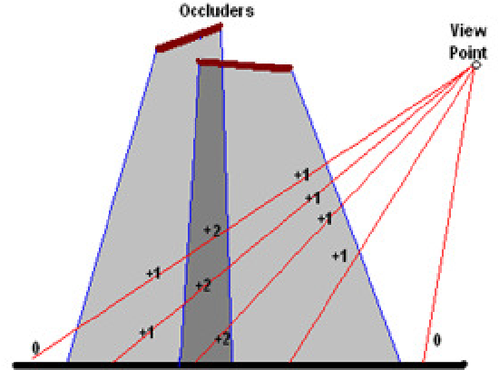

10.3 고급 조명 기법과 전역 조명

# 10.3.1 이미지 기반 조명

### normal 맵

* 각 텍셀의 표면 법선 방향을 나타내는 벡터를 담은 텍스처 맵
* 삼각형 표면에 법선값을 넣어서 그럴듯한 음영이 지게 만드는 방법
* 법선 벡터는 vector3 로 rgb값에 담기는데 음의 값이 될 수 있기 때문에 적절한 조치가 필요

### height 맵

* 삼각형 표면에 높낱이를 표현할때 쓰는 텍스처 맵
* 높낮이는 float하나면 되니깐 그레이스케일 이미지로
* paraliax / relief 매핑에 높이맵을 사용하는 경우가 많다고함
    * 뭔지는 잘 몰르겠음
    * 자체 차폐, 자체 그림자가 되는 고저차 있는 표면을 만들 수 있다고함
    * 옛날엔 표면 법선 만들때도 썻는데 요즘 법선맵써서 잘 안쓴다고함

### specular 맵

* 표면의 광택(specular정반사도)를 표현하고 싶을 때 사용하는 맵
* 어떤 부분은 더럽고 어떤부분은 반짝반짝
* specular항 ks(R*V)^a 의 상수중 텍셀에 뭘 넣냐에 따라
    * 정반사 마스크: ks값을 텍셀별로 저장 (0넣으면 노반사)
    * 정반사 지수맵: a 값을 저장 (어느정도로 정반사도가 집중될거냐?)

### environment 맵
* 물체를 둘러싼 풍경을 미리 찍어서 사용하는 텍스처맵
* 값싼 반사 구현할때 많이 사용함
* 종류
    * 구형맵: 어안렌즈로 찍은 사진
        * 구면좌표라서 수직각도가 천정에 가까워 지면 방향 정확도가 문제가 됨
    * 큐브맵: 정육면체의 6방향으로 찍은 사진을 합쳐놓은것
* 환경맵 사용하기
    * 카메라에서 시작해 물체 표면의 한점 P로 향하는 벡터 V 를 구한다
    * V를 P의 표면 법선에 반사시킨 벡터를 구한다 V'
    * V'가 환경 맵의 구 또는 큐브와 만나는 지점의 텍셀을 사용해 P의 색을 결정한다.

### 3차원 텍스처
* 3차원 텍스처는 2D 텍스처를 쌓은것
* 물체의 외형을 기술하거나 용적에 대한 속성을 나타낼때 유용하다

# 10.3.2 HDR 조명
* 목적
    * TV, CRT 모니터는 한정된 강도범위만 표현할 수 있다.
    * 현실의 빛의 강도는 무한히 커질 수 있다.
    * HDR조명은 현실의 넓은 범위의 빛 강도를 표현하기 위한 것이다.
* 방법
    * 조명 계산의 결과를 0 ~ 1 사이로 클리핑 하지 않는다.
    * 스크린에 디스플레이 하기전에 색조 매핑을 통해 이미지의 강도 범위를 디스플레이 장치가 허용하는 범위로 이동하고 스케일 한다.
* RGB(8비트) 대신 logLUV (32비트) 색 모델을 주로 사용한다.
    * 명도(L: 16비트), 색도(U / V: 각각 8비트) 채널을 사용
    * 광범위한 명도범위를 위해 L값은 로그(2)로 저장

# 10.3.3 전역조명
* 광원에서 나온 빛이 카메라에 도달하는 과정에서 다른 물체들과 상호작용하는 현상을 표현하는것
### 그림자 볼륨
* 광원에서 그림자를 만드는 물체들을 바라볼때 생기는 물체의 외곽선 모서리를 구한다.
* 모서리를 광원에서부터 나오는 빛의 방향으로 밀어낸다
* 이렇게 생성된 공간을 그림자 볼륨이라 한다.
* 카메라의 위치에서 그림자 볼륨을 기준으로 스텐실 버퍼를 기록한다.
    * 스텐실 버퍼는 z버퍼처럼 픽셀마다 하나의 정수값을 저장할 수 있다.
    * 그림자 볼륨의 앞을 향하는 삼각형들은 1을 증가시킨다.
    * 뒤를 향하는 삼각형들은 1을 감소시킨다.
    
* 그림자 렌더링할 때 스텐실 버퍼의 값에 따라 어둡게 표현하면 된다.

### 그림자 맵
* 광원의 시점에서 깊이 테스트해서 만든 그림자 맵 텍스처
* z버퍼에서 단편이 가려지는지 체크하는것처럼 그림자를 만드는지 체크하는것
* 삼각형의 정점마다 광원공간에서 위치를 계산해서 정점정보를 저장
* 픽셀 쉐이더에서 단편의 광원 공간 좌표를 그림자 맵의 텍스처 좌표로 변환해서 체크
* 가려진 경우 어둡게, 아니면 밝게

### 환경 광 차폐
* 환경광에 의해서만 장면을 조명할 때 생기는 약한 그림자 표현
* 해당 점을 중심으로 큰 반구를 만든다음 그 점이 얼마의 비율로 보이는지를 계산
* 외부 요인과 무관하므로 오프라인 렌더링해서 사용
* 잘안보이는 부분을 어둡게 표현

### 반사
* 대충 반사할때 환경맵
* 완벽 반사하려면 카메라 위치를 반사표면에 대칭시켜서 텍스처 렌더링
* 텍스처를 반사표면에 입히기

### 초 곡면 효과
* 물이나 금속의 강렬한 반사/산란 표현
* 매우 밝은 정반사 하이라이트
* 랜덤한 하이라이트를 담고 있는 텍스처 (애니메이션 텍스처일 수도)를 표면에 투영

### 표면하 산란
* 빛이 한 점으로 들어갔다가 다른 점으로 나오는 현상
* BSSRDF
* z버퍼 같은거로 광선이 물체를 뚫고 지나가는데 필요한 거리를 측정
* 물체의 그림자가 지는 부분에 빛이 물체를 통과하는 거리에 반비례한 난반사(diffuse)값을 더해준다.
* 두께가 얇은 부분에서 광원의 반대편이 살짝 밝게보임

### PRT
* radiosity 기반 렌더링
* 입사광이 표면에 어떻게 작용하는지를 모든 방향에서 미리 계산하고 저장하는 방식
* 런타임에 특정한 입사 광선이 주어지면 그에 대응하는 값을 찾아내고 정확한 조명 결과로 변환
* 표면의 한 점의 빛의 작용을 점을 중심으로 하는 반구위에 정의된 함수로 표현
* 엄청 어려워 보인다.

# 10.3.4 지연 렌더링
### 기존 레스터라이즈 렌더링의 비효율성
* 삼각형의 정점들 연산을 했는데 z테스트 통과 못하는 경우
* 다수의 광원이 있는 복잡한 장면에서 정점/픽셀 쉐이더 관리가 어렵다. (조명수가 다르거나, 광원 타입이 다르거나, 스키닝 가중치가 다르거나)

### 지연 렌더링
* 조명계산은 스크린 공간에서 수행
* 조명은 고려하지 않고 장면을 그림
* 픽셀 조명에 필요한 모든 정보는 G버퍼에 저장
* G버퍼의 정보를 이용해 조명과 셰이딩 계산을 한다.
* G버퍼는 장면속의 조명과 물체들의 표면속성에 대한 정보를 담는 프레임 버퍼
* 깊이, 표면법선, 난반사 색, 정반사 지수, PRT계수

