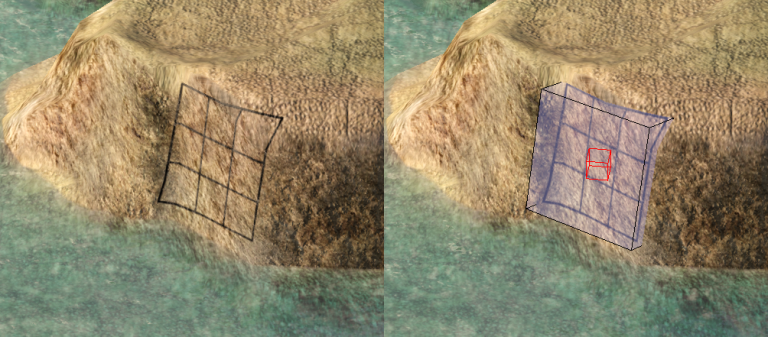

# 시각 효과와 오버레이
* 3D 오브젝트 외의 렌더링

# 10.4.1 파티클 효과
* 연기, 불꽃, 불 등 일정한 형상이 없는 물체를 구현
* 상대적으로 단순한 기하 형상의 모임
* 항상 카메라를 향함 (빌보드)
    *  쿼드의 법선벡터가 항상 카메라의 초점을 향하게 따로 처리해줘야함
* 머터리얼이 반투명, 렌더링 순서를 엄격하게 지켜줘야함
* 파티클의 위치, 방향, 크기, 텍스쳐 좌표, 셰이더 전달 인자가 프레임마다 바뀜
    * 절차적인 방식으로 정의
    * 커스텀 애니메이션 곡선으로 정의
* 파티클을 계속해서 스폰하는 이미터
    * 스폰된 파티클은 정해진 조건을 충족하면 사라짐 (시간, 충돌등)
# 10.4.2 데칼
* 일반적 기하 형상의 표면에 씌우는 작은 기하 형상
* 표면의 외양을 바꾸는데 쓰임
    * 총탄 흔적, 발자국, 긁힌 흔적, 갈라진 흔적
* 데칼을 사각형 영역으로 모델링하고 화면에 일직선으로 투영해서 구현 (언리얼)
    * 3차원 공간에 직육면체 프리즘이 생성됨
    * 프리즘이 맨처음 교차하는 표면에 데칼이 입혀짐
    * 교차하는 기하형상의 삼각형을 투영된 프리즘의 네 경계 평면으로 클리핑
    * 각 정점마다 적당한 텍스처 좌표를 계산하고 클리핑한 삼각형들을 데칼 텍스처에 매핑
    * parallex mapping을 통해 깊이감을 주고 z 갚을 조정해서 z fighting이 일어나지 않게 한다.
    * 

# 10.4.3 환경 효과

### 10.4.3.1 하늘
* 프레임 버퍼에 하늘 텍스처를 먼저 박는 방법
    * 3D기하 형상 렌더링 하기전에 먼저 넣음
    * 카메라의 움직임을 따라 회전, 스크롤 할 수 있기도 함
    * 프레임 버퍼값을 충분히 크게 줄것
* 스카이박스 스카이돔
    * 카메라의 위치가 중심이 되게 그린다
    * 3D 형상보다 먼저 렌더링하고 z값을 충분히 크게 한다
    * 버퍼에 z값만 크게 넣기만하면 크기가 엄청 클 필요는 없다 
* 구름
    * 별도의 렌더링 /애니메이션 시스템을 많이 쓴다
    * 평면에 스크롤하는 반투명한 구름 텍스처를 입힌 방식으로 구현
    * 빌보드, 파티클 기반 구현
    * 입체 구름 효과(?)

### 10.4.3.2 지형
* 다른 정적 / 동적 요소들이 놓일수 있는 토대를 제공
* 지형을 직접 제작할 수도 있지만 시야가 넓은 게임에서는 별도의 테셀레이션이나 LOD 시스템이 필요하다
* 높이 필드 지형 (height field terrain)
    * 넓은 지형을 모델링하는데 자주 사용되는 방식
    * 높이 필드 데이터를 그레이 텍스처로 저장
    * 수평 평면을 격자 패턴으로 테셀레이션하고 각 지점에 높이 필드 텍스처로 매핑해서 높이 값을 얻는다
    * 카메라와의 거리에 따라 지역당 삼각형 수를 변경해서 가까운 지점은 세밀하게 표현할 수 있다.
* 지형 텍스처
    * 흙, 자갈, 잔디등 네 개 이상의 텍스처를 블렌딩해서 사용한다.
    * 한 계층에서 다른 계층으로 서서히 블랜딩해서 자연스러운 변화를 구현할 수 있다.
* 지형 도구
    * 높이 필드를 색칠 할 수 있는 전용 도구를 제공
    * 지형의 일부분을 파낸후 그 위에 특수한 지형지물을 일반 메시로 만들어 집어 넣을 수 있는 기능을 제공하기도한다.
    * 지형 제작툴은 게임 월드 에디터에 완전히 통합된 경우도 있고 분리된 경우도 있다.

### 10.4.3.3 물
* 바다, 호수, 강, 폭포, 분수, 물줄기, 웅덩이, 축축한 표면
* 다양한 물의 종류가 있고 각각 특수한 렌더링 기법이 필요하다
* 넓은 부분을 차지하는 물은 LOD, 테셀레이션이 필요하다.
* 강체역학 시스템 및 게임 플레이에 상호영향을 미치는 경우도 있다.
* 여러 렌더링 기법과 하부 시스템을 조합해서 사용한다.
    * 폭포를 구현하려면 특수한 물 셰이더, 스크롤 텍스처, 안개 파티클, 거품 데칼 오버레이등이 필요하다.

# 10.4.4 오버레이
* HUD, UI 등등 뷰 공간이나 스크린 공간에 직접 렌더링하는 2차원 (혹은 3차원) 오브젝트
* 주 장면의 렌더링 마친후 z 테스트 끄고 그린다.
* 2차원 오버레이는 쿼드(삼각형 한쌍)을 스크린 공간에서 직교 투영해서 렌더링
* 3차원 오버레이는 직교투영이나 통상 원근 투영으로 렌더링
    * 뷰 공간의 기하형상이 항상 카메라를 따라다니도록 구현

### 10.4.4.1 정규화된 스크린 좌표
* 게임이 다양한 해상도를 지원하는 경우 정규화된 스크린 좌표를 사용하자
* 두 축중 하나(보통 y축)를 기준으로 0 부터 1 까지의 범위를 갖는다.
    * 둘다하면 비율이 이상해져서 안됨
* 화면 비율만 신경쓰면 해상도는 고려할 필요 없다.

### 10.4.4.2 상대적 스크린 좌표
* 화면의 중심, 오른쪽, 왼쪽, 밑, 위등 기준점에서 상대적으로 떨어진 위치를 표시
* 화면의 비율이 변해도 상대적 위치는 유효한 경우가 많다.

### 10.4.4.3 텍스트와 폰트
* 특수한 2차원 오버레이를 통해 구현
* 화면내의 다양한 위치와 방향에 맞게 텍스트 문자열의 문자 그리프를 순서대로 그림
* 폰트는 글리프를 모아서 텍스처 맵으로 구현
* 폰트 정보 파일은 텍스처 내 각 글리프의 경계박스, 커닝, 기준선 오프셋등 폰트 위치정보를 제공
* 여러가지 언어에 따른 문자셋의 차이와 읽기등 방향을 처리하기도함
* 글자들을 화면에서 움직이거나 글자 자체를 에니메이션하는 기능등을 제공하기도
* 게임에서 필요한 것들만 딱딱 구현하는게 좋음

# 10.4.5 감마 보정
* CRT모니터는 휘도(luminance) 값에 비선형적으로 반응함
* 선형적으로 증가하는 RGB값을 보내면 사람눈엔 비선형적으로 변하는것처럼 보임
* [참고](http://blog.naver.com/PostView.nhn?blogId=team_csr&logNo=221026941983&redirect=Dlog&widgetTypeCall=true&directAccess=false)
* 이런 현상을 보정하기 위해 CRT디스플레이에 보내는 색에 역변환을 거치는 것을 감마 보정이라고 한다.
* 감마 인코딩을 3D렌더링 엔진에서 할 수 있지만 텍스처 맵에 사용된 이미지가 자체 감마 보정된 경우가 많아서 문제가 될 수 있다.
* 렌더링 전에 텍스처들을 감마 디코딩하고 렌더링 끝난후 다시 감마 인코딩 하는 방식으로 제대로된 색이 스크린에 보이게 보장할 수 있다.

# 10.4.6 풀스크린 후처리 효과 (Post Effect)

* 렌더링된 3차원 장면에 적용해서 부가적 사실성을 더하거나 멋스런 효과를 내는 것
* 스크린 전체의 내용을 특수한 픽셀 셰이더를 통과시켜 원하는 효과를 적용하게 만든다.
* 원래의 장면이 렌더링된 텍스처를 화면 전체 크기의 쿼드에 매핑하고 이걸 렌더링함
* 모션 블러
    * 스크린 공간 속도 벡터를 저장하는 버퍼를 렌더링하고 이것을 통해 렌더링된 이미지를 선택적으로 흐리게 만드는 방법
    * 블러는 컨볼루션 커널을 이미지에 적용해서 구현
* DoF 블러
    * 깊이 버퍼의 내용을 가지고 각 픽셀을 얼마나 흐리게 할지를 조정하는 기법
* 비그넷
    * 화면의 모퉁이 부분에서 이미지의 명도 채도를 감소시켜서 극적인 효과를 낸다.
    * 스크린 위에 텍스처 오버레이를 렌더링 하는 방식으로 단순하게 구현할 수도 있다
    * 망원경이나 무기의 조준경을 통해 바라볼때 흔희 쓰이는 둥그런 모양의 효과등
* 채색 효과
    * 후처리 과정에서 스크린의 픽셀 색깔을 마음대로 변경할 수도 있음
    * 붉은 색을 제외한 다른 모든색을 줄여서 회색으로 만들수 있음 (씬시티)